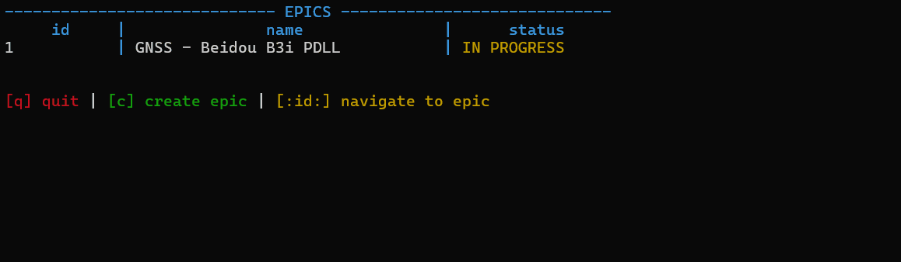

# JIRA CLI

## Objective

In this project, the following is practiced:

- Building CLI apps in Rust
- Reading & writing to disk
- Using third-party crates (like `serde`, `anyhow`, `itertools`, etc.)
- Writing testable code
- Organizing code using modules
- Navigating and contributing to an existing code base

## Terminologies

**Jira, Epic & Story**

Jira is an industry-standard tool for tracking progress of (not limited to) software projects. An Epic is usually used for entire initiatives, while a Story is a smaller unit of work with more specific instructions.

**Model**
Models describe how information is organized, transmitted or stored.

**Database / Storage / Persistence**

Database, storage and persistence are often used interchangeably. They represent the component we use to store and access information for the application.

**CRUD**

CRUD stands for actions of creation, read, update & deletion.
